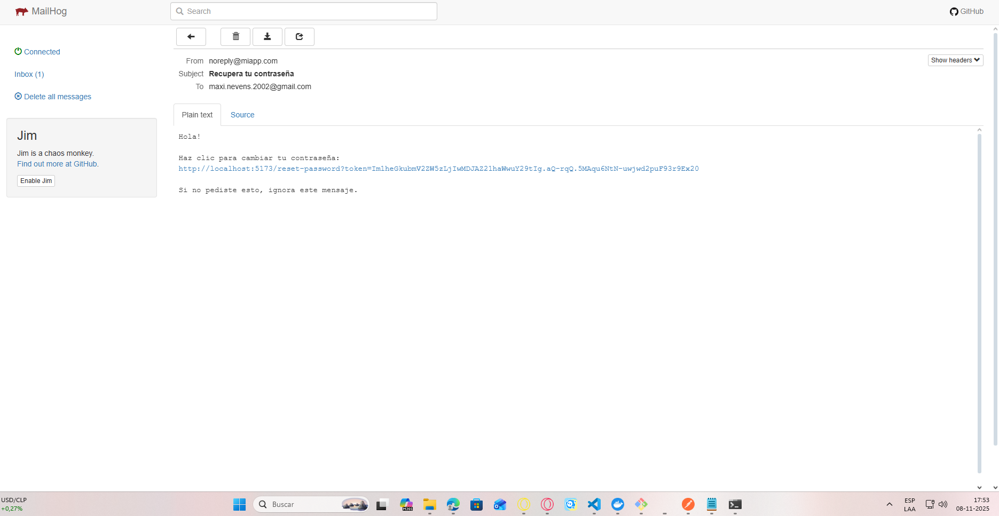

# Pasos para instalar 
    1. Clona la rama
    2. En git bash escribe:
        1.docker-compose down -v
        2. npm ci
        3. npm run build
        4. docker-compose up --build
    3. En una terminal aparte de git entra el directorio frontend y tipea:
        1. npm run dev
        2. Ve a tu navegador y busca localhost:5173
        

